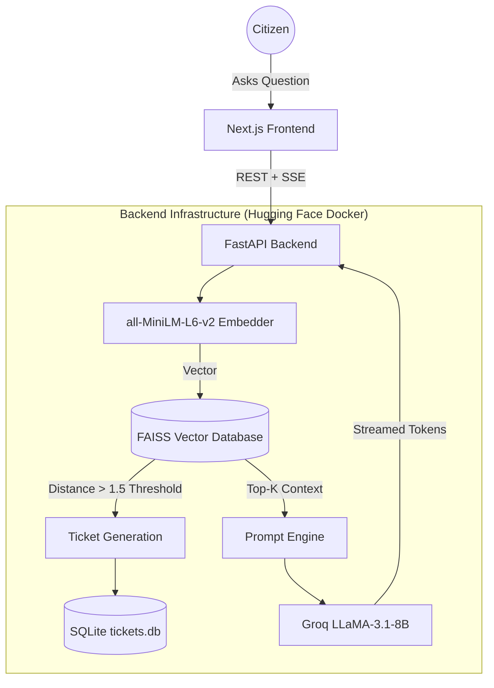

<div align="center">
  
  
  
  
  
  <br>
  <h1>🏛️ GovtScheme AI Copilot</h1>
  <p><b>An Enterprise-Grade Retrieval-Augmented Generation (RAG) Framework for Indian E-Governance</b></p>
</div>

---

## 📖 Overview

The **GovtScheme AI Copilot** is a state-of-the-art conversational AI assistant designed to democratize access to Indian public welfare schemes. Traditional government portals rely on rigid keyword searches that fail to understand natural language. This project solves that by utilizing a specialized **Retrieval-Augmented Generation (RAG)** pipeline.

By combining the semantic intelligence of **LLaMA-3.1 (8B)** with the high-speed vector retrieval of **FAISS**, this system guarantees zero hallucinations. It only answers questions based on the official dataset, ensuring citizens receive 100% factually accurate eligibility criteria and benefits.

### 🌟 Core Features
- **Conversational Search**: Understands complex, multi-turn natural language queries.
- **Zero Hallucination Guarantee**: Constrained by L2 distance thresholds, the AI will refuse to answer rather than invent fake government policies.
- **Automated Support Ticketing**: If a query's answer is not in the database, the system automatically logs the query into a SQLite database and issues a `Ticket ID` to the user.
- **Lightning Fast Inference**: Powered by **Groq LPUs**, achieving sub-300ms Time-To-First-Token (TTFT) via Server-Sent Events (SSE) streaming.

---

## 🚀 Live Demo & Endpoints

The entire architecture is deployed globally and is available for public testing:

- 🌐 **Frontend Web Portal**: [Live on Vercel](https://govtschemecopilot.vercel.app)
- ⚙️ **Backend API (Swagger Docs)**: [Live on Hugging Face Spaces](https://chauhanaman01-ovtscheme-backend.hf.space/docs)
- 🎫 **Live Support Tickets DB**: [View Automated Ticket Logs](https://chauhanaman01-ovtscheme-backend.hf.space/api/tickets)

---

## 🏗️ System Architecture



---

## 📂 Repository Structure

```text
GovtScheme-AI-Copilot/
├── Dataset/                 # Contains myscheme_cleaned.csv (500+ Welfare Schemes)
├── backend/                 # Python FastAPI Microservice
│   ├── data_pipeline.py     # Script to generate Embeddings and FAISS Index
│   ├── llm_client.py        # Groq LLaMA-3.1 API interface and SSE streaming
│   ├── rag_engine.py        # FAISS search and Top-K retrieval logic
│   ├── ticket_system.py     # Automated SQLite Ticket logging system
│   ├── main.py              # FastAPI application and route definitions
│   ├── requirements.txt     # Python dependencies
│   └── Dockerfile           # HF Spaces Deployment configuration
├── frontend/                # Next.js Application
│   ├── src/app/             # Application Routes (App Router)
│   ├── src/components/ui/   # Tailwind/React Components (ChatInterface, MessageBubble)
│   └── tailwind.config.ts   # Design Tokens
├── report.tex               # Comprehensive Academic LaTeX Report
└── README.md                # You are here!
```

---

## 🛠️ Local Development Setup

To run this complex RAG architecture on your local machine, follow these steps:

### 1. Clone the Repository
```bash
git clone https://github.com/AmanChauhan7010/GovtScheme-AI-Copilot.git
cd GovtScheme-AI-Copilot
```

### 2. Backend Setup (FastAPI + FAISS)
You need Python 3.10+ installed.

```bash
cd backend

# Create and activate a virtual environment
python -m venv venv
source venv/bin/activate  # On Windows use: venv\Scripts\activate

# Install dependencies
pip install -r requirements.txt

# Configure your environment variables
cp .env.example .env
```
Open the `.env` file and add your **Groq API Key**:
```env
OPENAI_API_KEY="gsk_your_groq_api_key_here"
OPENAI_BASE_URL="https://api.groq.com/openai/v1"
LLM_MODEL_NAME="llama-3.1-8b-instant"
```

**Run the Backend Server:**
```bash
uvicorn main:app --reload --port 8000
```

### 3. Frontend Setup (Next.js)
Open a new terminal window. You need Node.js 18+ installed.

```bash
cd frontend

# Install Node modules
npm install

# Create environment configuration
echo "NEXT_PUBLIC_API_URL=http://localhost:8000" > .env.local

# Run the development server
npm run dev
```
The UI will now be accessible at `http://localhost:3000`.

---

## 📊 Technical Specifications & Hyperparameters

| Component | Architecture / Value |
|-----------|----------------------|
| **Embedding Model** | `all-MiniLM-L6-v2` (384 Dimensions) |
| **Vector DB** | `FAISS` (IndexFlatL2) |
| **L2 Distance Cutoff** | $\tau = 1.5$ (Triggers SQLite Ticket System) |
| **LLM Inference Engine** | `Groq LPUs` |
| **Generative Model** | `LLaMA-3.1-8B-Instant` |
| **Temperature** | `0.3` (To enforce strict factual adherence) |

---

## 👥 Team ReLU Rangers

This framework was researched, designed, and developed as a Deep Learning academic initiative at **Dhirubhai Ambani University**.

* **Chauhan Aman Satpal** (M.Sc. Data Science)
* **Kunal Pramanik** (M.Sc. Data Science)
* **Jinal Sasiya** (M.Sc. Data Science)

---
<div align="center">
  <i>"Democratizing e-governance through intelligent, ethical, and highly secure AI architecture."</i>
</div>
